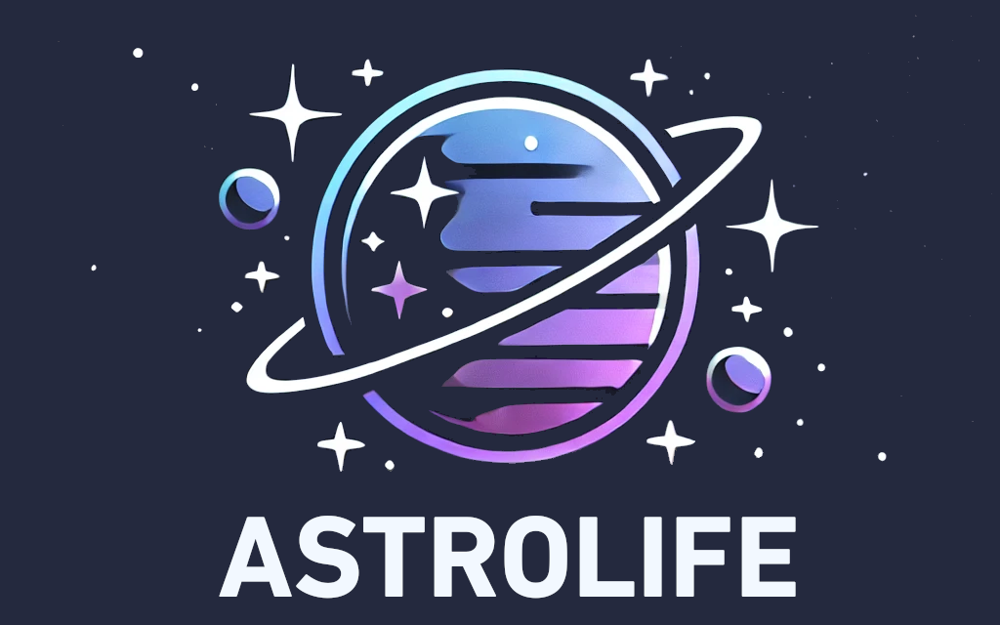

# AstroLife-Lite v0.1



This version of AstroLife includes only a small part of galaxy images; one can download the full version by running the download script in the galaxy_data folder.
 

## Usage

to install:
```
pip install -e .
```

then run with:
```
astrolife -u YOUR_USER_NAME
```

## Introduction

### What is AstroLife-Lite?

Astrolife-Lite is a game made with Python that allows players to act like astronomers. Players can make scores by observing, researching, learning, attending conferences, and more. The main window of the game is shown below.


### What can players do in AstroLife-Lite?

- **Shop**: Players can buy items from the shop, such as observation time, upgradings, and telescopes


- **Manage Observations**: Players can buy observation time in astrolife with their fundings. Then then can manage their observations by marking the date in the calender.


- **Research**: After doing observations, players can do research using their observations and then submit their work for publication, then they will obtain achievements which is the largest contribution to the score. They should have some knowledge of their selected field, which can be obtained from "Learn" section. Here wee need to note that their is some possibility of failure when doing research, depending on the target journal.


- **Learn**: Players can learn different fields of astronomy in this section, it's notable that one needs to keep their knowledge balanced.


- **Conference**: Players can attend conferences to earn reputations, reputations are critical when applying for funding. Here we need to note that one must meet the requirements of the conference within a DDL to attend it.


- **Apply for Funding**: Players can apply for funding in this section, there is some possibility of failure when applying for funding, which is demonstrated in the window.


- **Classification**: The best part of the game! If the players think their funding is too low, they can make money by helping real-world astronomers to classify galaxies.

